# COMPAS Flowcharts & High-Level Flows
## Berdasarkan EXECUTIVE_VISION.md dan AI_REVIEW_SESSION.md

**Color Palette Used:** p2.png (Purple to Cyan gradient)
- Primary: #5B21B6 (Deep Purple)
- Secondary: #A855F7 (Purple)
- Tertiary: #C4B5FD (Lavender)
- Accent 1: #BAD5F5 (Light Blue)
- Accent 2: #A7F3D0 (Cyan/Mint)

---

## 1. COMPAS HIGH-LEVEL ARCHITECTURE FLOW

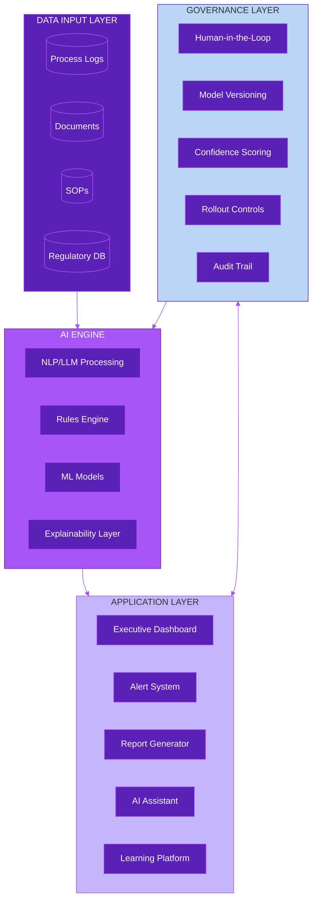

---

## 2. REGULATORY CHANGE AUTO-ADAPT FLOW (Original)

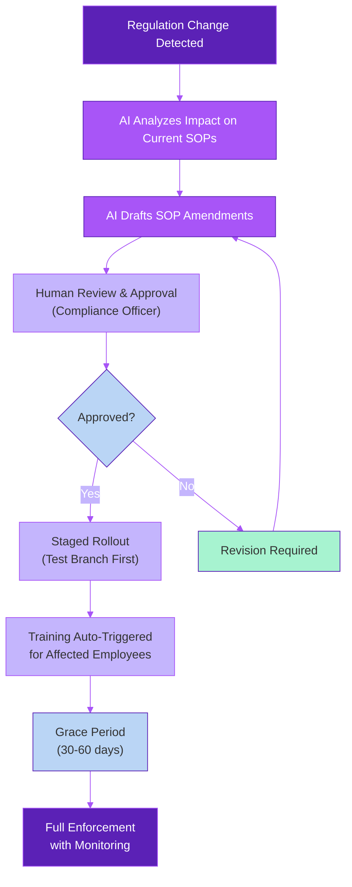

---

## 3. DEVIATION DETECTION FLOW

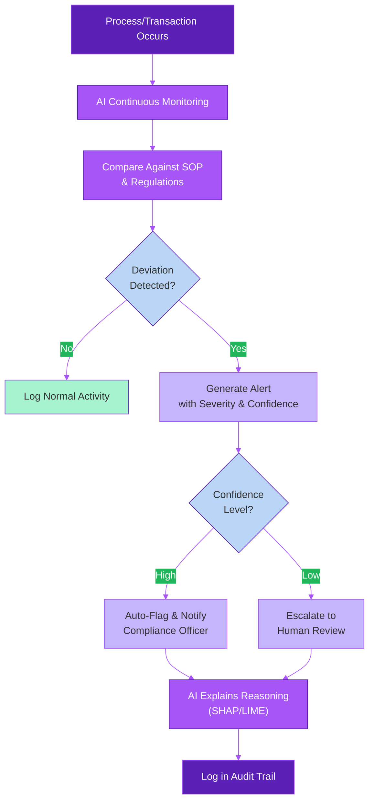

---

## 4. GO-TO-MARKET PHASE FLOW (Legacy - See Section 7 for Revised)

> **Note:** This was the original 15-month timeline. See **Section 7** for the revised 18-24 month timeline based on AI Review recommendations.

```mermaid
%%{init: {'theme': 'base', 'themeVariables': { 'primaryColor': '#5B21B6', 'primaryTextColor': '#fff', 'primaryBorderColor': '#A855F7', 'lineColor': '#A855F7'}}}%%

flowchart LR
    subgraph P1["PHASE 1: Internal Pilot"]
        direction TB
        A1["Month 1-3"]
        A2["Target: SQE Internal"]
        A3["Goal: 80% SOPs Digitized"]
    end

    subgraph P2["PHASE 2: FS Pilot"]
        direction TB
        B1["Month 4-9"]
        B2["Target: Sinarmas Multifinance"]
        B3["Goal: 50% Audit Prep Reduction"]
    end

    subgraph P3["PHASE 3: FS Rollout"]
        direction TB
        C1["Month 10-15"]
        C2["Target: Bank Sinarmas, ASM"]
        C3["Goal: Full SMMA Coverage"]
    end

    subgraph P4["PHASE 4: Mining"]
        direction TB
        D1["Month 16+"]
        D2["Target: GEMS/DSSA"]
        D3["Goal: Cross-Pillar Platform"]
    end

    P1 --> P2 --> P3 --> P4

    style P1 fill:#5B21B6,stroke:#A855F7,color:#fff
    style P2 fill:#A855F7,stroke:#5B21B6,color:#fff
    style P3 fill:#C4B5FD,stroke:#A855F7,color:#333
    style P4 fill:#BAD5F5,stroke:#5B21B6,color:#333
```

---

## 5. LEARNING ENGAGEMENT FLOW (Legacy - See Section 8 for Revised)

> **Note:** This was the original "Gamified Learning" approach. See **Section 8** for the revised "Contextual Compliance Engagement" framework based on AI Review recommendations.

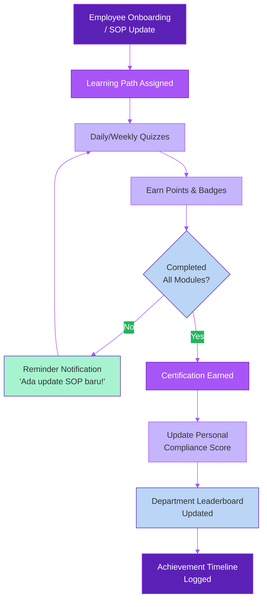

---

# REVISED FLOWS (Berdasarkan AI_REVIEW_SESSION.md)

---

## 6. REVISED: REGULATORY CHANGE AUTO-ADAPT FLOW (Enhanced)
**Perubahan:** Ditambahkan Dynamic Regulatory Adaptation Framework, Human-in-the-Loop mandatory, dan RAG safeguards

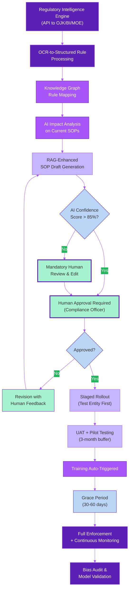

---

## 7. REVISED: GO-TO-MARKET PHASE FLOW (18-24 Months)
**Perubahan:** Timeline diperpanjang sesuai rekomendasi AI Review

```mermaid
%%{init: {'theme': 'base', 'themeVariables': { 'primaryColor': '#5B21B6', 'primaryTextColor': '#fff', 'primaryBorderColor': '#A855F7', 'lineColor': '#A855F7'}}}%%

flowchart LR
    subgraph P1["PHASE 1"]
        direction TB
        A1["Month 1-6"]
        A2["Core SaaS Platform"]
        A3["Synthetic Data Pipeline"]
        A4["MVP: Dashboard + Assistant"]
    end

    subgraph P2["PHASE 2"]
        direction TB
        B1["Month 7-10"]
        B2["Human-in-Loop Modules"]
        B3["High-Risk Alert Workflows"]
        B4["PDP Law Compliance"]
    end

    subgraph P3["PHASE 3"]
        direction TB
        C1["Month 11-16"]
        C2["Regional Pilots"]
        C3["Jurisdiction-Specific Testing"]
        C4["ROI Validation"]
    end

    subgraph P4["PHASE 4"]
        direction TB
        D1["Month 17-21"]
        D2["SMMA Full Rollout"]
        D3["Cross-Entity Benchmarking"]
        D4["3-Month UAT Buffer"]
    end

    subgraph P5["PHASE 5"]
        direction TB
        E1["Month 22-24+"]
        E2["Mining Expansion"]
        E3["GEMS/DSSA Integration"]
        E4["External Monetization"]
    end

    P1 --> P2 --> P3 --> P4 --> P5

    style P1 fill:#5B21B6,stroke:#A855F7,color:#fff
    style P2 fill:#A855F7,stroke:#5B21B6,color:#fff
    style P3 fill:#C4B5FD,stroke:#A855F7,color:#333
    style P4 fill:#BAD5F5,stroke:#5B21B6,color:#333
    style P5 fill:#A7F3D0,stroke:#5B21B6,color:#333
```

---

## 8. REVISED: CONTEXTUAL COMPLIANCE ENGAGEMENT FLOW
**Perubahan:** Gamification di-reframe menjadi "Contextual Compliance Engagement" sesuai rekomendasi AI Review

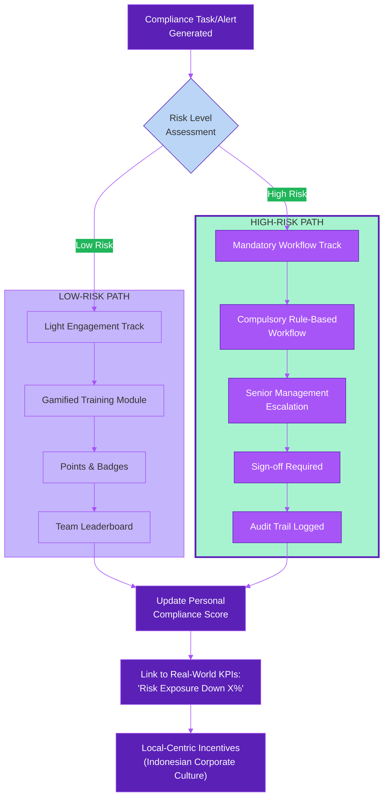

---

## 9. NEW: DATA STRATEGY & ETL FLOW
**Ditambahkan:** Sesuai rekomendasi AI Review untuk mengatasi Data/ETL strategy yang missing

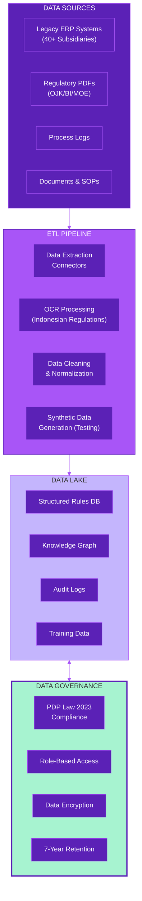

---

## 10. NEW: HUMAN-IN-THE-LOOP WORKFLOW
**Ditambahkan:** Sesuai rekomendasi AI Review untuk mandatory human review

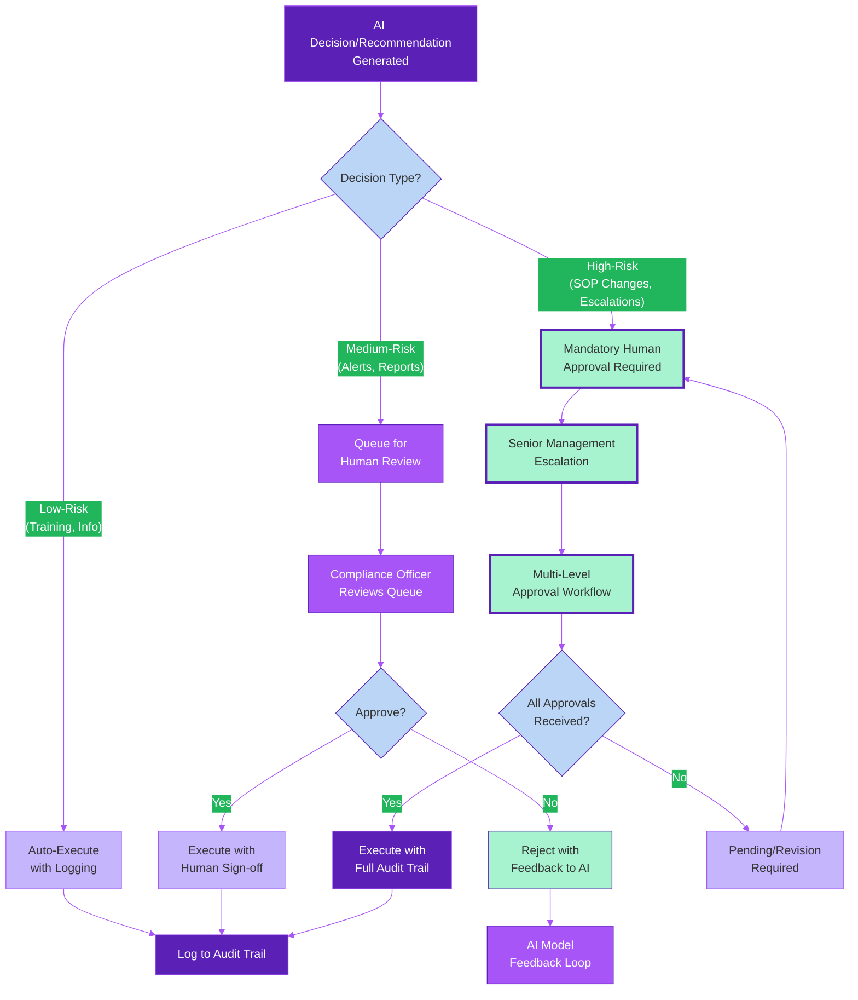

---

## 11. EXECUTIVE SUMMARY: ORIGINAL vs REVISED COMPARISON

```mermaid
%%{init: {'theme': 'base', 'themeVariables': { 'primaryColor': '#5B21B6', 'primaryTextColor': '#fff', 'primaryBorderColor': '#A855F7', 'lineColor': '#A855F7'}}}%%

flowchart LR
    subgraph ORIGINAL["ORIGINAL VISION"]
        direction TB
        O1["15-Month Timeline"]
        O2["Gamification Focus"]
        O3["Auto-Adapt (AI-First)"]
        O4["Basic Data Integration"]
        O5["Implicit Human Review"]
    end

    subgraph ARROW[" "]
        direction TB
        AR["AI REVIEW<br/>RECOMMENDATIONS"]
    end

    subgraph REVISED["REVISED VISION"]
        direction TB
        R1["18-24 Month Timeline<br/>+ UAT Buffer"]
        R2["Contextual Engagement<br/>(Risk-Based)"]
        R3["RAG + Human-in-Loop<br/>Mandatory"]
        R4["Full ETL + Data Lake<br/>+ PDP Compliance"]
        R5["Explicit Approval<br/>Workflows"]
    end

    ORIGINAL --> ARROW --> REVISED

    style ORIGINAL fill:#C4B5FD,stroke:#A855F7,color:#333
    style ARROW fill:#A855F7,stroke:#5B21B6,color:#fff
    style REVISED fill:#A7F3D0,stroke:#5B21B6,color:#333,stroke-width:3px
```

---

## Color Legend

| Color | Hex Code | Usage |
|-------|----------|-------|
| Deep Purple | #5B21B6 | Primary elements, critical actions |
| Purple | #A855F7 | Secondary elements, AI processes |
| Lavender | #C4B5FD | Tertiary elements, user interactions |
| Light Blue | #BAD5F5 | Decision points, conditional flows |
| Cyan/Mint | #A7F3D0 | Human-in-the-loop elements, NEW additions |

---

**Document Info:**
- Generated for: COMPAS (Compliance Process Automation Service)
- Based on: EXECUTIVE_VISION.md + AI_REVIEW_SESSION.md
- Palette: p2.png (Purple to Cyan gradient)
- Format: Mermaid.js compatible

---

*"Be the golden bridge that people want to pass and could pass to make their lives and activities easier."*

**— Tata**
