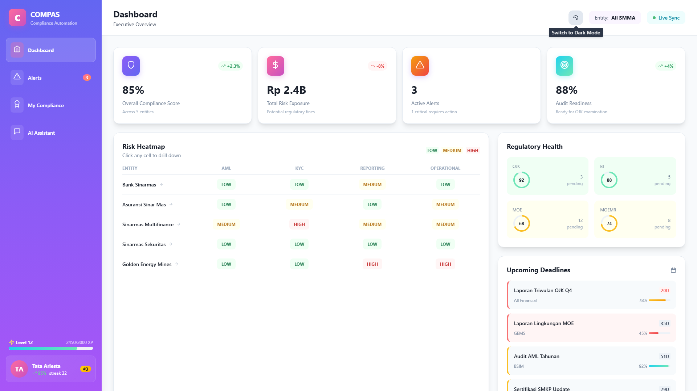
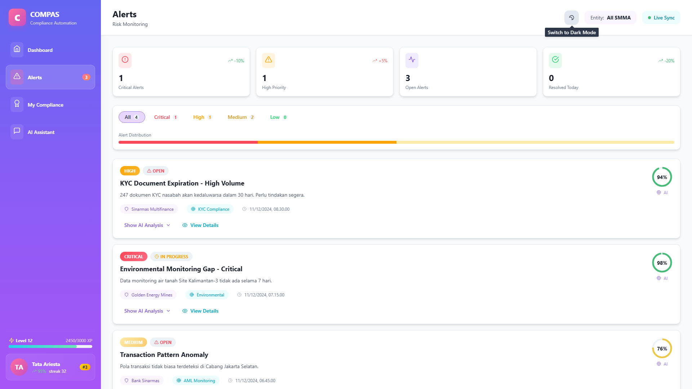
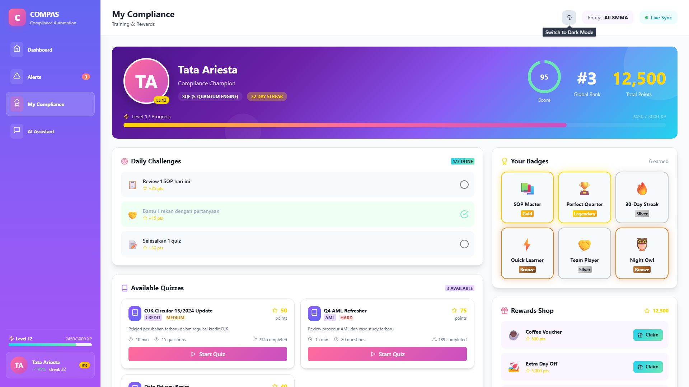
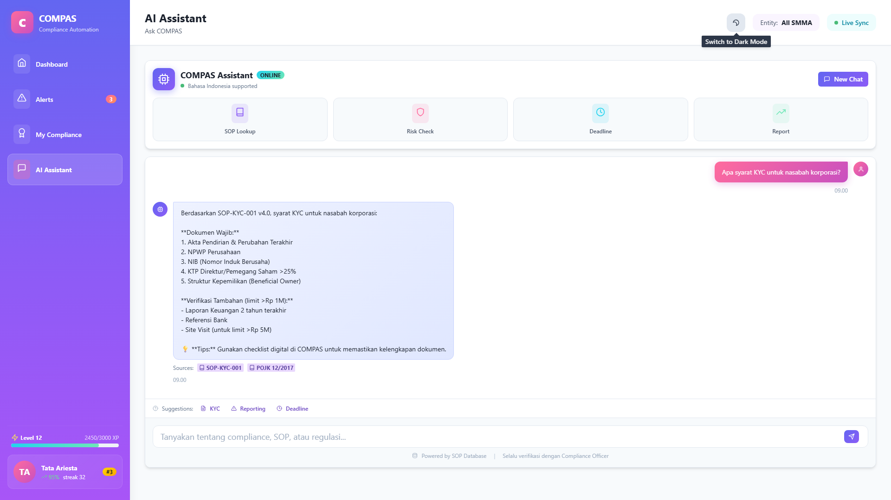
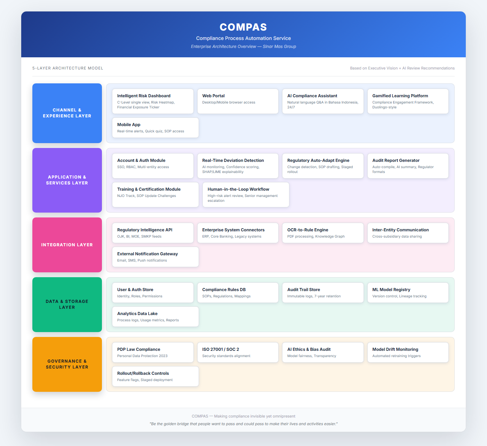
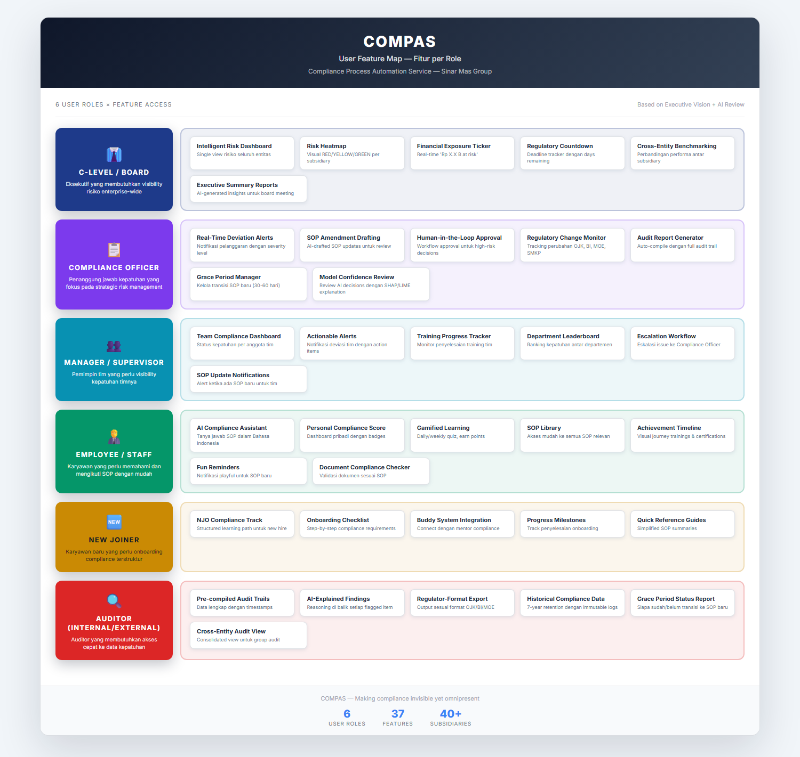

# COMPAS
## Compliance Process Automation Service
### Product Requirements Document (PRD)

---

**Product Name:** COMPAS (Compliance Process Automation Service)
**Version:** 1.0
**Author:** Banat Zata (Tata)
**Date:** December 2024
**Status:** Final

---

## Table of Contents

### Part 1: AI Product Concept Evaluation & Recommendation
1. [Project Selection & Justification](#1-project-selection--justification)
2. [Market Opportunity & Problem Solved](#2-market-opportunity--problem-solved)
3. [Competitive Landscape](#3-competitive-landscape)
4. [Feasibility Assessment](#4-feasibility-assessment)
5. [Hypothesis Validation](#5-hypothesis-validation)

### Part 2: High-Level Project Plan & Simple PRD
6. [Project Plan Approach](#6-project-plan-approach)
7. [Simple PRD - Core AI Feature](#7-simple-prd---core-ai-feature)
8. [Screen Inventory (Sampling)](#8-screen-inventory-sampling)

---

# PART 1: AI PRODUCT CONCEPT EVALUATION & RECOMMENDATION

---

## 1. Project Selection & Justification

### 1.1 Executive Summary

> **Chosen Project:** AI Monitoring for Operational Process & Regulation Alignment (COMPAS)

> **One-line Justification:** COMPAS addresses a mission-critical need with built-in customer base (40+ SMMA subsidiaries), clearer ROI through compliance cost avoidance, and stronger strategic alignment with SQE's position as digital enabler for Sinar Mas Group.

### 1.2 Comparative Analysis

| Criteria | Concept 1: Market Insights Platform | Concept 2: COMPAS (Compliance AI) | Winner |
|----------|-------------------------------------|-----------------------------------|--------|
| **Market Opportunity** | Large but crowded market; many established players | Growing RegTech market (19.6% CAGR); less competition in Indonesian market | **COMPAS** |
| **Competitive Landscape** | Dominated by Bloomberg, Nielsen, Gartner; high barrier | Limited local players; global GRC tools lack Indonesian regulatory expertise | **COMPAS** |
| **Technical Feasibility** | Requires diverse external data sources; complex NLP for sentiment | Internal data available; rule-based + AI hybrid approach | **COMPAS** |
| **Business Impact** | Revenue generation (uncertain adoption) | Cost avoidance (Rp 10B+ fines); license protection; rating confidence | **COMPAS** |
| **Strategic Fit** | Generic B2B product; no unique SQE advantage | Perfect fit: 40+ captive subsidiaries; cross-pillar (Finance + Mining) | **COMPAS** |
| **TOTAL** | 1/5 | **5/5** | **COMPAS** |

### 1.3 Justification Narrative

**Why COMPAS?**

1. **Market Opportunity:** The RegTech market is projected to grow from $14.9B (2024) to $106.9B (2035) at 19.6% CAGR. Indonesian regulatory environment is becoming stricter with MOE Regulation No. 20/2025, OJK strengthening, and ESG pressure from investors.

2. **Competitive Advantage:** No existing solution combines Indonesian regulatory intelligence (OJK, BI, MOE), Bahasa Indonesia AI assistant, and cross-pillar design for both Financial Services and Mining. Global players like IBM OpenPages and SAP GRC lack local regulatory expertise.

3. **Technical Feasibility:** Core data (SOPs, process logs, regulatory documents) exists within Sinar Mas Group. AI approach can start with rule-based systems enhanced by ML, reducing initial complexity. RAG architecture prevents hallucination risks.

4. **Business Impact:** Direct cost avoidance through preventing regulatory fines (OJK fines can reach billions of Rupiah), license protection, and audit efficiency (70% time reduction). ROI is measurable and immediate.

5. **Strategic Alignment:** SQE positions as the digital transformation enabler for Sinar Mas Group. COMPAS serves 40+ SMMA subsidiaries immediately, with expansion path to Mining pillar (DSSA/GEMS - USD 3B revenue).

**Why NOT Market Insights Platform?**

- Highly competitive market with established players (Bloomberg, Nielsen, Gartner, Palantir)
- Requires significant external data acquisition costs
- No unique SQE advantage; would compete as generic vendor
- Longer path to ROI with uncertain enterprise adoption
- Less strategic alignment with Sinar Mas Group's immediate needs

---

## 2. Market Opportunity & Problem Solved

### 2.1 Problem Statement

**The Core Problem:**
> Large conglomerates like Sinar Mas Group struggle to maintain consistent compliance across 40+ subsidiaries, each managing compliance independently with fragmented standards, reactive approaches, and manual processes that consume 60-70% of compliance officers' time on documentation rather than strategic risk management.

**Who Experiences This Problem?**

| Stakeholder | Pain Point | Current Solution | Gap |
|-------------|------------|------------------|-----|
| **C-Level / Board** | No single view of enterprise-wide compliance risk; surprises during audits | Quarterly reports from each subsidiary | Real-time visibility; proactive risk identification |
| **Compliance Officers** | 60-70% time on documentation; reactive issue discovery | Manual spreadsheets; email-based tracking | Automation; predictive risk detection |
| **Department Managers** | Unclear SOP requirements; fear of audit findings | Ad-hoc compliance training | Clear guidance; real-time compliance status |
| **Employees** | Complex SOPs; don't know "why" behind rules | PDF manuals; occasional training | Easy-to-understand guidance; AI assistant |
| **Auditors** | Time-consuming audit preparation; incomplete trails | Manual evidence collection | Pre-compiled audit trails; AI-generated summaries |

### 2.2 Market Size

| Market | Size | Source |
|--------|------|--------|
| **TAM (Global RegTech)** | $14.9B (2024) → $106.9B (2035) | Precedence Research |
| **TAM (AI Compliance Monitoring)** | $1.8B (2024) → $5.2B (2030) | MarketsandMarkets |
| **SAM (SEA Financial Services GRC)** | ~$500M (2024) | Industry estimates |
| **SOM (Indonesia Enterprise GRC)** | ~$50M (2024) | Sinar Mas internal data |
| **Initial Target (SMMA)** | $5-10M internal budget allocation | SQE estimates |
| **CAGR** | 19.6% (RegTech), 19.4% (AI Compliance) | Multiple sources |

### 2.3 Target Customer Segments

| Segment | Description | Priority |
|---------|-------------|----------|
| **SMMA Financial Services** | Bank Sinarmas, Asuransi Sinar Mas, Sinarmas Multifinance, etc. (40+ entities) | P0 |
| **Mining Pillar (DSSA/GEMS)** | Large mining operations with environmental compliance needs; USD 3B revenue | P1 |
| **External Indonesian Conglomerates** | Similar multi-entity structures with compliance challenges | P2 (Future) |

---

## 3. Competitive Landscape

### 3.1 Competitor Analysis

| Competitor | Type | Strengths | Weaknesses |
|------------|------|-----------|------------|
| **IBM OpenPages** | Direct (Global) | Enterprise GRC; Watson AI integration; brand trust | Expensive; no Indonesian regulatory expertise; complex implementation |
| **SAP GRC** | Direct (Global) | Deep ERP integration; comprehensive modules | Locked to SAP ecosystem; limited AI capabilities; no local language support |
| **ServiceNow GRC** | Direct (Global) | Modern UX; IT workflow integration | Adapted from ITSM, not compliance-first; limited regulatory content |
| **Celonis** | Indirect | Process mining leadership; AI-powered insights | Process-first, not compliance-first; no gamification; expensive |
| **Local Consultants** | Indirect | Indonesian regulatory knowledge; relationship-based | Manual processes; not scalable; no AI capabilities |
| **Singapore GRC Startups** | Regional | Regional presence; modern tech stack | Limited Indonesian regulatory depth; smaller scale |

### 3.2 SQE's Strategic Advantages

| Advantage | How to Leverage |
|-----------|-----------------|
| **Built-in Customer Base** | 40+ SMMA subsidiaries ready for pilot; no sales cycle needed |
| **Local Regulatory Expertise** | Deep OJK, BI, MOE knowledge; partnership potential with regulators |
| **Cross-Pillar Position** | Unique opportunity to serve both Financial Services AND Mining |
| **Sinar Mas Ecosystem** | Integration with existing digital products (ASJ, GARASI Dealer) |
| **Indonesian Language** | Native Bahasa Indonesia AI assistant; cultural understanding |

### 3.3 Key Differentiators

1. **Indonesian Regulatory Intelligence:** Built-in knowledge of OJK, BI, MOE, SMKP regulations with OCR capability for Indonesian regulatory PDFs and API integration with regulatory bodies.

2. **Bahasa Indonesia AI Assistant:** RAG-grounded natural language compliance support that answers questions, cites SOPs, and explains "why" behind requirements - 24/7 availability for all employees.

3. **Human-in-the-Loop by Design:** Mandatory human approval for high-risk decisions; multi-level escalation workflow; full audit trail - addressing Indonesian corporate culture's preference for human oversight.

4. **Contextual Compliance Engagement:** Risk-based approach replacing generic gamification; links compliance to real-world KPIs; respects Indonesian corporate culture.

5. **Cross-Pillar Architecture:** Designed from day one for both Financial Services and Mining compliance requirements.

6. **PDP Law 2023 Native:** Data protection built-in; data residency compliance; 7-year retention aligned with regulatory requirements.

---

## 4. Feasibility Assessment

### 4.1 Data Availability & Quality

| Data Type | Source | Availability | Challenges |
|-----------|--------|--------------|------------|
| **SOPs & Policies** | Internal documentation | High | Inconsistent formats; some in PDF |
| **Process Logs** | ERP systems (40+ subsidiaries) | Medium | Legacy system diversity; ETL complexity |
| **Regulatory Documents** | OJK, BI, MOE publications | Medium | PDF format; handwritten notes; no API |
| **Transaction Data** | Core banking, ERP | High | Privacy concerns; data residency |
| **Training Records** | HR systems | Medium | Fragmented across entities |

**Privacy & Ethical Considerations:**

| Concern | Regulation | Mitigation |
|---------|------------|------------|
| Personal Data Processing | PDP Law 2023 (UU PDP) | Privacy by design; consent management; data minimization |
| Financial Data Residency | OJK regulations | On-premise/local cloud option; encryption |
| Employee Monitoring | Labor laws | Transparency; aggregate metrics; no individual surveillance |
| AI Decision Transparency | Emerging AI regulations | SHAP/LIME explainability; human-in-the-loop |

### 4.2 AI Model Complexity

| Capability | AI Type | Complexity | Maturity |
|------------|---------|------------|----------|
| **Deviation Detection** | Rule-based + ML Classification | Medium | Proven |
| **Document Processing** | OCR + NLP | Medium | Proven |
| **AI Assistant** | LLM + RAG | Medium-High | Proven (with safeguards) |
| **Regulatory Change Detection** | NLP + Knowledge Graph | High | Emerging |
| **Risk Scoring** | ML Regression/Classification | Medium | Proven |
| **Explainability** | SHAP/LIME | Medium | Proven |

**Key Technical Considerations:**
- Bahasa Indonesia NLP is 15-20% less accurate than English; requires fine-tuning
- RAG architecture essential to prevent hallucinations in compliance context
- Hybrid approach: start rule-based, enhance with ML over time
- Model retraining: quarterly with regulatory updates

### 4.3 Computational Needs & Infrastructure

| Requirement | Specification | Cost Estimate |
|-------------|---------------|---------------|
| **Training Infrastructure** | GPU cluster (4x A100) for initial training | $8,000/month (cloud) |
| **Inference Infrastructure** | CPU-based for most; GPU for AI assistant | $3,000/month |
| **Storage** | 10TB initial; 50TB growth | $500/month |
| **LLM API** | OpenAI/Anthropic API for assistant | $2,000-5,000/month |
| **Total (Cloud)** | | ~$15,000/month |

**Infrastructure Recommendation:** Hybrid approach
- Cloud (AWS/GCP) for development and scaling flexibility
- On-premise option for sensitive financial data (OJK compliance)

### 4.4 Integration Challenges

| System | Complexity | Challenge | Mitigation |
|--------|------------|-----------|------------|
| **Legacy ERPs (40+)** | High | Diverse systems; outdated APIs | Phased integration; API gateway; data connectors |
| **Core Banking** | High | Real-time requirements; security | Dedicated secure channel; batch processing option |
| **HR Systems** | Medium | Fragmented across entities | Standard data model; manual upload fallback |
| **Regulatory Sources** | Medium | No official API; PDF-heavy | OCR pipeline; manual update process |

---

## 5. Hypothesis Validation

### 5.1 Key Hypotheses & Validation

| ID | Hypothesis | Category | Validation Method | Success Criteria |
|----|------------|----------|-------------------|------------------|
| **H1** | Compliance officers spend 60%+ time on manual documentation | User Need | Survey + time tracking study | >50% confirm; baseline established |
| **H2** | AI can detect SOP deviations with >90% accuracy | Technical | POC with historical data | Precision >90%, Recall >85% |
| **H3** | Indonesian regulatory PDFs can be processed with >85% accuracy | Technical | OCR benchmark test | Character accuracy >85% |
| **H4** | Users will adopt AI assistant for compliance questions | User Need | Beta test with 50 users | >70% weekly active usage |
| **H5** | Human-in-the-loop workflow acceptable to management | Market | Executive interviews | >80% approval from compliance heads |
| **H6** | ROI achievable within 12 months | Market | Financial modeling + pilot metrics | Cost avoidance > implementation cost |

### 5.2 Validation Timeline

```
Week 1-4          Week 5-8          Week 9-12         Week 13-16
    │                 │                 │                 │
    ▼                 ▼                 ▼                 ▼
[Market Research   [Technical POC    [User Beta        [Synthesis &
 H1, H5, H6]        H2, H3]           H4]               Go/No-Go]

Activities:        Activities:        Activities:        Activities:
- Stakeholder      - OCR accuracy     - 50-user pilot   - Consolidate
  interviews         test             - Usage tracking    findings
- Time study       - Deviation        - Feedback        - ROI validation
- Financial          detection POC      surveys         - Executive
  modeling         - LLM+RAG test                         presentation
```

---

# PART 2: HIGH-LEVEL PROJECT PLAN & SIMPLE PRD

---

## 6. Project Plan Approach

### 6.1 Strategic Alignment

| SQE Strategic Goal | How This Project Aligns |
|--------------------|-------------------------|
| **Digital Transformation** | Transforms manual compliance processes into AI-powered automation; positions SQE as AI leader within Sinar Mas |
| **Market Leadership** | First-mover advantage in Indonesian RegTech; builds competitive moat through local regulatory intelligence |
| **Revenue Growth** | Internal budget allocation from 40+ subsidiaries; future external monetization; cross-pillar expansion to Mining |
| **Operational Excellence** | Reduces compliance FTE effort by 30%; prevents costly regulatory fines; improves audit readiness |

### 6.2 Key Milestones & Timeline

**Visual Timeline (18-24 Months):**

```
Month 1-6        Month 7-12       Month 13-18      Month 19-24
    │                │                │                │
    ▼                ▼                ▼                ▼
┌────────┐      ┌────────┐      ┌────────┐      ┌────────┐
│ Phase 1│ ──►  │ Phase 2│ ──►  │ Phase 3│ ──►  │ Phase 4│
│  MVP   │      │ Pilot  │      │ Rollout│      │ Expand │
└────────┘      └────────┘      └────────┘      └────────┘
```

| Phase | Duration | Key Deliverables |
|-------|----------|------------------|
| **Phase 1: MVP Development** | Month 1-6 | Core platform; Dashboard; AI Assistant (basic); SQE internal pilot |
| **Phase 2: Pilot & Validation** | Month 7-12 | Human-in-loop modules; One SMMA subsidiary pilot; ROI validation |
| **Phase 3: SMMA Rollout** | Month 13-18 | Full SMMA deployment; Cross-entity benchmarking; 3-month UAT buffer |
| **Phase 4: Expansion** | Month 19-24 | Mining pillar (GEMS/DSSA); External monetization exploration |

**Key Milestones:**

| Milestone | Target | Success Criteria |
|-----------|--------|------------------|
| M1: MVP Launch | Month 6 | Dashboard + AI Assistant functional; 80% SQE SOPs digitized |
| M2: Pilot Complete | Month 12 | 50% audit time reduction; Zero missed deadlines; 90% adoption |
| M3: SMMA Rollout | Month 18 | 20+ subsidiaries live; Cross-entity benchmarking operational |
| M4: Mining Pilot | Month 24 | GEMS/DSSA pilot launched; Environmental compliance module |

### 6.3 Key Stakeholders

**Internal:**

| Stakeholder | Role | Engagement |
|-------------|------|------------|
| **SMMA C-Level** | Executive Sponsor | Monthly steering committee; budget approval |
| **SQE Leadership** | Product Owner | Weekly reviews; resource allocation |
| **Engineering Team** | Builder | Daily standups; sprint planning |
| **Compliance Officers** | Domain Expert + User | Requirements validation; beta testing |
| **Legal/Compliance** | Reviewer | Regulatory alignment; PDP Law compliance |

**External:**

| Stakeholder | Role | Engagement |
|-------------|------|------------|
| **Pilot Subsidiary** | First customer | Co-development; feedback loop |
| **OJK/BI/MOE** | Regulators | Compliance validation; potential partnership |
| **LLM Providers** | Technology partner | API integration; SLA management |
| **Auditors (External)** | Validator | Audit trail requirements; acceptance testing |

### 6.4 Metrics of Success

**AI Performance:**

| Metric | Target |
|--------|--------|
| Deviation Detection Accuracy | 95%+ precision |
| Deviation Detection Recall | 90%+ recall |
| AI Assistant Response Accuracy | 90%+ (RAG-grounded) |
| Response Latency | < 3 seconds (dashboard); < 5 seconds (AI assistant) |
| False Positive Rate | < 10% |

**Business Impact:**

| Metric | Baseline | Target |
|--------|----------|--------|
| Audit Preparation Time | ~4 weeks | < 1 week (70% reduction) |
| Compliance FTE Effort | 100% (current) | 70% (30% reduction) |
| Missed Compliance Deadlines | X per year | Zero |
| Potential Fines Avoided | N/A | Rp 10B+ exposure reduction |
| User Adoption | N/A | 90% monthly active users |
| NPS Score | N/A | 40+ |
| ROI | N/A | 5:1 within 12 months |

---

## 7. Simple PRD - Core AI Feature

> **Focus:** Real-Time Deviation Detection & Alert System

### 7.1 Feature Overview

| Attribute | Description |
|-----------|-------------|
| **Feature Name** | Real-Time Deviation Detection & Alert System |
| **Purpose** | Continuously monitor operational processes and detect compliance deviations before they become violations |
| **User Problem** | Compliance issues are discovered during audits (reactive), not before - leading to fines, remediation costs, and operational disruption |
| **Target User** | Compliance Officers, Department Managers, C-Level Executives |

### 7.2 Acceptance Criteria

| ID | Criteria (Given/When/Then) |
|----|----------------------------|
| **AC-1** | Given a process/transaction occurs, When AI detects deviation from SOP, Then system generates alert within 5 minutes with severity level and confidence score |
| **AC-2** | Given an alert is generated, When confidence < 85%, Then alert is automatically escalated to human review queue |
| **AC-3** | Given an alert is generated, When user clicks "Explain", Then AI provides reasoning using SHAP/LIME methodology with cited SOP references |
| **AC-4** | Given multiple alerts exist, When Compliance Officer views dashboard, Then alerts are prioritized by risk score (severity × confidence × business impact) |
| **AC-5** | Given alert is reviewed, When user takes action (acknowledge/escalate/dismiss), Then decision is logged in immutable audit trail with timestamp and user ID |
| **AC-6** | Given user dismisses alert as false positive, When feedback is submitted, Then system logs feedback for model improvement |

### 7.3 Key AI-Driven Functionality

**How AI Works (User Perspective):**

```
┌──────────────────┐      ┌──────────────────┐      ┌──────────────────┐
│  PROCESS OCCURS  │ ──►  │   AI MONITORS    │ ──►  │  ALERT GENERATED │
│  (Transaction,   │      │  (Compare to SOP │      │  (Severity,      │
│   Document, etc) │      │   & Regulations) │      │   Confidence,    │
└──────────────────┘      └──────────────────┘      │   Explanation)   │
                                                     └──────────────────┘
```

| Step | User Action | AI Response | User Sees |
|------|-------------|-------------|-----------|
| 1 | Normal work (transaction, document upload) | AI continuously monitors against SOP rules | Nothing (seamless) |
| 2 | - | AI detects potential deviation | Alert notification with severity badge |
| 3 | Click alert to view details | AI retrieves context and generates explanation | Alert card: what happened, why flagged, confidence % |
| 4 | Click "Explain" | SHAP/LIME analysis + RAG retrieval | Visual explanation: "This was flagged because X exceeds threshold Y per SOP Z" |
| 5 | Take action (Acknowledge/Escalate/Dismiss) | Log decision; update model if feedback provided | Confirmation; audit trail entry |

**AI Decision Transparency:**

Every alert includes:
- **What:** Description of the detected deviation
- **Why:** AI reasoning with SHAP/LIME feature importance
- **Source:** Cited SOP section and regulatory reference
- **Confidence:** Percentage score (triggers human review if < 85%)
- **Recommended Action:** AI-suggested next steps

### 7.4 High-Level AI Technical Considerations

**Data Feeds:**

| Data | Source | Frequency |
|------|--------|-----------|
| Process/Transaction Logs | ERP systems, Core Banking | Real-time streaming |
| Document Uploads | Document management system | Event-triggered |
| SOP Rules | COMPAS Rules Engine | Cached; updated on SOP changes |
| Regulatory Requirements | Regulatory DB + Knowledge Graph | Daily sync |
| Historical Decisions | Audit Trail | Batch (model retraining) |

**Core AI Approach:**

| Component | Approach | Rationale |
|-----------|----------|-----------|
| **Rule Matching** | Rule-based engine | Deterministic; high accuracy for known rules; explainable |
| **Anomaly Detection** | Isolation Forest + Autoencoder | Catches unknown deviations; learns from data |
| **Severity Classification** | Gradient Boosting (XGBoost) | Proven accuracy; feature importance for explainability |
| **Explainability** | SHAP (global) + LIME (local) | Industry standard; regulatory acceptance |
| **RAG for Context** | LLM + Vector DB (Pinecone/Weaviate) | Grounds explanations in actual SOP text; prevents hallucination |

**AI Pipeline:**

```
┌─────────────┐   ┌─────────────┐   ┌─────────────┐   ┌─────────────┐
│ Data Input  │──►│ Rule Check  │──►│ ML Scoring  │──►│ Alert Gen   │
│ (Streaming) │   │ (Deterministic)│ │ (Confidence)│   │ (Priority)  │
└─────────────┘   └─────────────┘   └─────────────┘   └─────────────┘
                                           │
                                           ▼
                                    ┌─────────────┐
                                    │ SHAP/LIME   │
                                    │ Explanation │
                                    └─────────────┘
```

### 7.5 Negative Cases (AI Failure Modes) & Mitigation

| Failure Mode | Impact | Probability | Mitigation | Fallback |
|--------------|--------|-------------|------------|----------|
| **False Positive (Alert Fatigue)** | Medium - Users ignore alerts; miss real issues | Medium | Confidence threshold tuning; user feedback loop; weekly false positive review | Allow users to mark false positives; auto-suppress repeat false positives after review |
| **False Negative (Missed Violation)** | High - Actual compliance breach goes undetected | Low | Conservative thresholds; regular model validation against known cases; parallel manual sampling | Periodic random audit of transactions not flagged; human spot-checks |
| **Model Drift** | Medium - Accuracy degrades over time | Medium | Automated drift monitoring; scheduled quarterly retraining; version control | Alert when accuracy drops below threshold; automatic rollback to previous model |
| **Explanation Hallucination** | High - AI cites non-existent SOP or gives wrong reasoning | Low | RAG architecture grounds all explanations in actual documents; confidence scoring | All explanations include source links; users can verify; low-confidence explanations flagged |

### 7.6 Quality Measurement

| Metric | Target | Measurement |
|--------|--------|-------------|
| **Precision** | > 95% | TP / (TP + FP) - Weekly evaluation against labeled data |
| **Recall** | > 90% | TP / (TP + FN) - Monthly audit of undetected violations |
| **F1 Score** | > 0.92 | Harmonic mean of precision and recall |
| **Alert Response Time** | < 5 minutes | Time from event to alert generation |
| **Explanation Accuracy** | > 90% | Human evaluation of explanation correctness (sample) |
| **User Satisfaction** | > 4.0/5.0 | Post-action survey; monthly NPS |
| **False Positive Rate** | < 10% | User-reported false positives / total alerts |

### 7.7 Non-Functional Requirements (AI-Specific)

| Category | Requirement |
|----------|-------------|
| **Compliance** | OJK data handling requirements; PDP Law 2023 (consent, data minimization, retention limits); ISO 27001 alignment |
| **Explainability** | SHAP/LIME for all ML decisions; Confidence scoring (0-100%); Source citation for all explanations |
| **Auditability** | 7-year log retention; Immutable audit trail; Model versioning with decision lineage; Who-what-when-why for every alert action |
| **Latency** | Dashboard load < 3 seconds; Alert generation < 5 minutes from event; AI explanation < 3 seconds |
| **Security** | AES-256 encryption at rest; TLS 1.3 in transit; RBAC with entity-level isolation; PII masking in logs |
| **Availability** | 99.9% uptime SLA; RTO < 4 hours; RPO < 1 hour; Active-passive failover |

---

## 8. Screen Inventory (Sampling)

> *Screenshot/mockup untuk fitur utama*

| Screen | Description | Screenshot |
|--------|-------------|------------|
| **Executive Dashboard** | C-Level single view with risk heatmap, financial exposure ticker, regulatory countdown |  |
| **Alert Management** | Real-time deviation alerts with severity, confidence, and AI explanation |  |
| **Compliance Engagement** | Personal compliance score, achievements, training modules |  |
| **AI Assistant** | Natural language compliance Q&A in Bahasa Indonesia |  |

### Enterprise Architecture Overview



*5-Layer Architecture: Channel & Experience → Application & Services → Integration → Data & Storage → Governance & Security*

### Role-Based Access



*Role access matrix showing permissions for C-Level, Compliance Officers, Managers, Employees, and Auditors*

---

## Appendix

### A. Glossary

| Term | Definition |
|------|------------|
| **COMPAS** | Compliance Process Automation Service |
| **RAG** | Retrieval-Augmented Generation - AI architecture that grounds LLM responses in retrieved documents |
| **SHAP** | SHapley Additive exPlanations - Method to explain ML model predictions |
| **LIME** | Local Interpretable Model-agnostic Explanations - Method to explain individual predictions |
| **SOP** | Standard Operating Procedure |
| **OJK** | Otoritas Jasa Keuangan (Financial Services Authority of Indonesia) |
| **BI** | Bank Indonesia (Central Bank) |
| **MOE** | Ministry of Environment |
| **PDP Law** | Personal Data Protection Law (UU PDP 2023) |
| **SMMA** | Sinar Mas Multiartha (Financial Services pillar) |
| **GRC** | Governance, Risk, and Compliance |
| **RegTech** | Regulatory Technology |

### B. References

| Document | Description |
|----------|-------------|
| EXECUTIVE_VISION.md | Original product vision document |
| AI_REVIEW_SESSION.md | AI peer review feedback (DeepSeek, Qwen, Grok) |
| compas_ea.html | Enterprise architecture visualization |
| COMPAS_FLOWCHARTS.html | Detailed process flowcharts |
| [SQE] PM AI_Case Study_Updated.pdf | Case study requirements |

### C. Revision History

| Version | Date | Author | Changes |
|---------|------|--------|---------|
| 0.1 | Dec 2024 | Banat Zata | Initial draft |
| 0.2 | Dec 2024 | Banat Zata | Incorporated AI review feedback |
| 1.0 | Dec 2024 | Banat Zata | Final version for case study submission |

---

*"Be the golden bridge that people want to pass and could pass to make their lives and activities easier."*

**— Tata**

---

*COMPAS PRD v1.0 | December 2024 | Prepared for SQE Senior Product Manager - AI & Enterprise Solutions Case Study*
